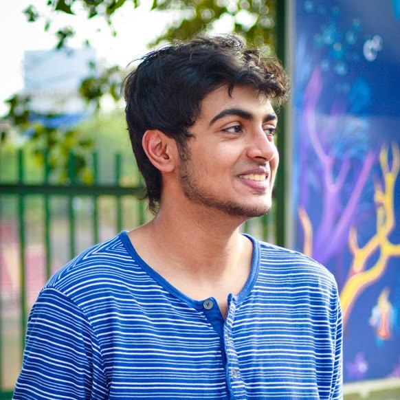
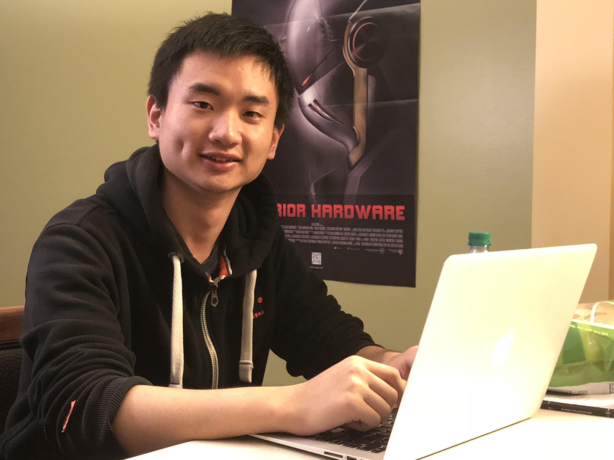
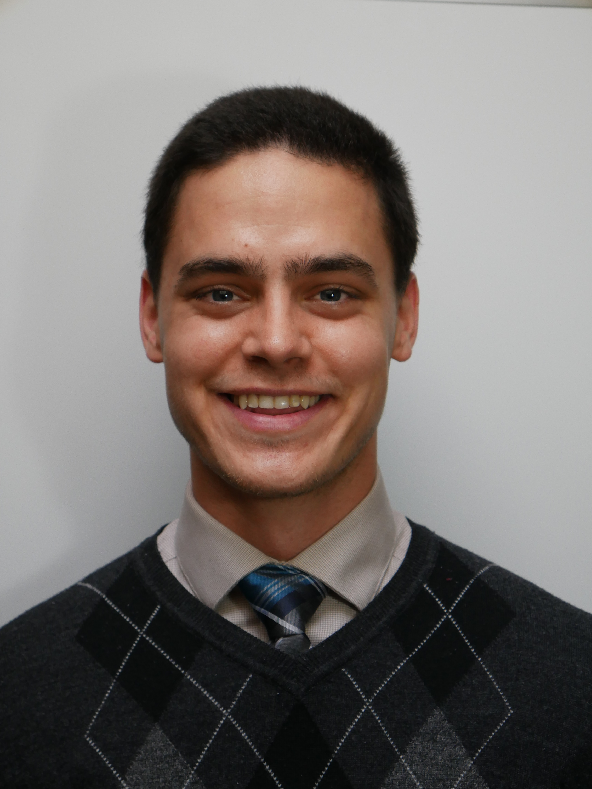

## AI at UW Leadership

### Head of Engineering

[Abhay Venkatesh](http://abhayvenkatesh.com) co-founded AI at UW in April, 2017, and served as the founding President for the club. In the past, he has interned and worked with [Facebook](https://facebook.com), [Stanford](https://stanford.edu), and [MIT](https://mit.edu). Currently, he is responsible for advising the club on operations, and heading the engineering efforts of the club. He is a research assistant for [Dr. Vikas Singh](http://www.biostat.wisc.edu/~vsingh/), doing work in Computer Vision and Machine Learning.

### Engineering Manager

Zhichun Huang joined AI at UW in October, 2017. He is a machine learning enthusiast, a hardcore gamer, and a soda addict. He is the engineering manager for Team Kaggle.

### Head of Business Development

Nickolas Comeau joined AI at UW in January, 2018, and was invited to the executive board during the following summer. He is particularly interested in computational biology and exploring machine learning through the lense of neuroscience. His current role in the organization is to assist in the management of a learning group on Tensorflow, assist with general administrative tasks, and explore possible sponsorship and fundraising opportunities.  
